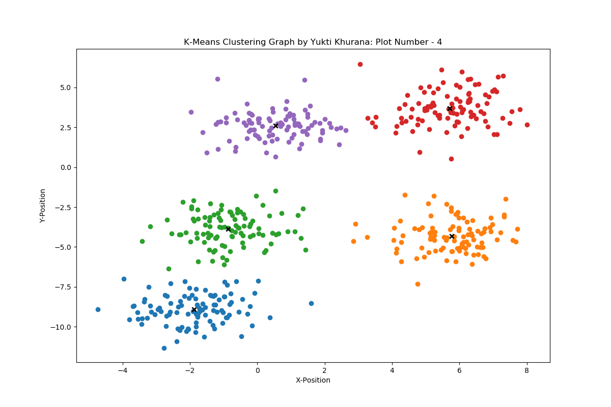

# k-means-clustering
Python Implementation of K-Means Clustering Algorithm	
	1. Kmeans_clustering.py is the class implementing this algorithm
	2. Kmeans_testing generates random value and tests the class by using Kmeans_clustering.py
	3. The output is displayed on the Terminal and plot graphs is displayed as well as stored in the PlotImages folder to see later

TO EXECUTE:

	python3 Kmeans_testing.py
  

